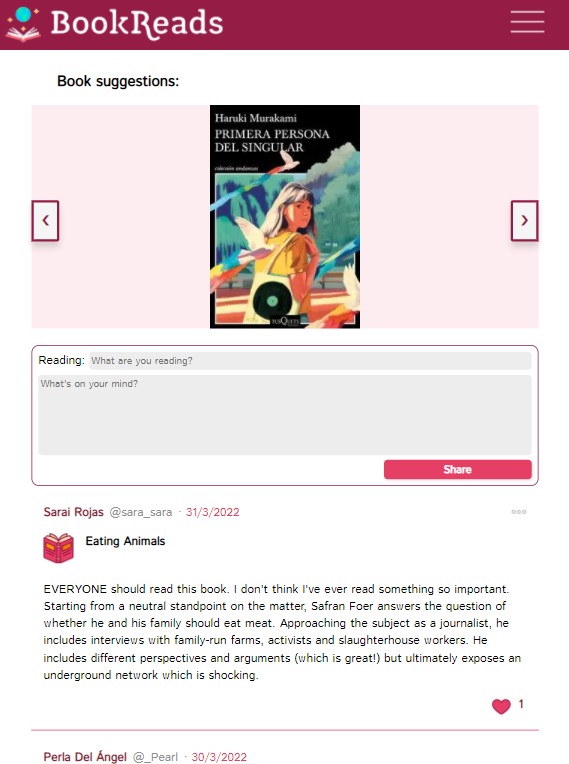
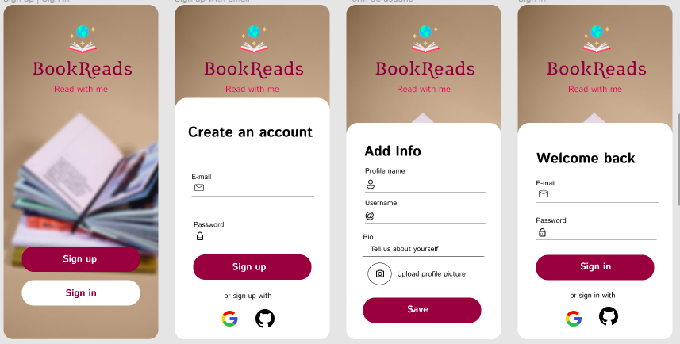
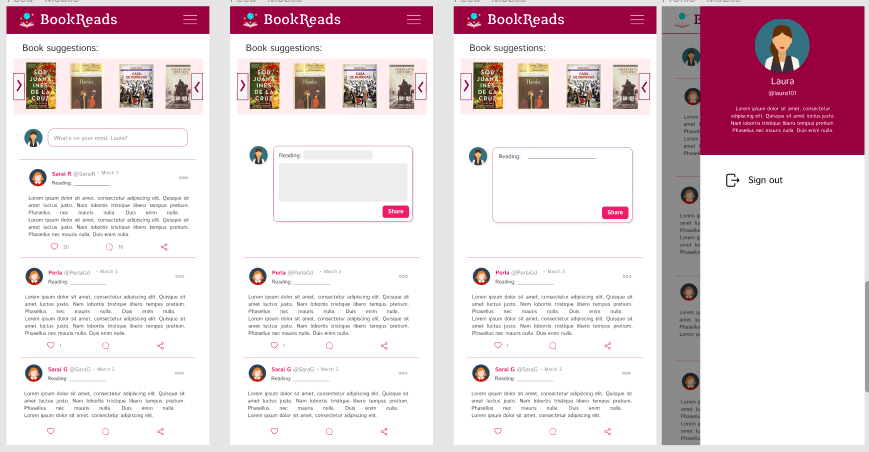
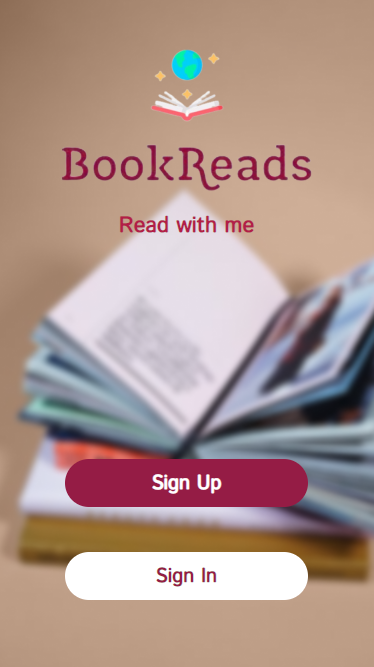
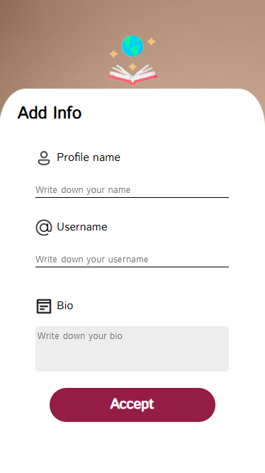
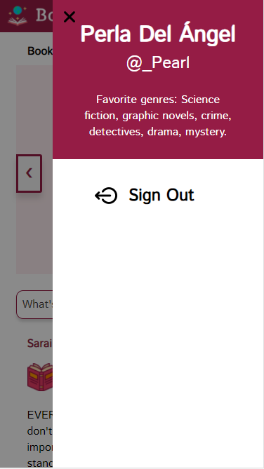

# Creando una Red Social

## Índice

- [1. Resumen del proyecto](#1-Resumen-del-proyecto)
- [2. UX research](#2-UX-research)
- [3. Prototipo de baja fidelidad](#3-Prototipo-de-baja-fidelidad)
- [4. Interfaz gráfica final](#5-Interfaz-gráfica-final)

## 1. Resumen del proyecto

En este proyecto se construyó una Red Social **"BookReads"** para los amantes de la lectura, su implementación es un SPA (single-page application) optimizada para moviles. BookReads permite a cualquier usuario crear una cuenta de acceso y loguearse con ella mediante correo, Google, Facebook y GitHub. Una vez creada una cuenta, el usuario puede establecer el nombre de perfil, nombre de usuario y una breve descripción. Una vez que el usuario haya completado su información de cuenta, se muestra el feed o timeline en donde podra crear posts sobre el libro que está leyendo o acaba de terminar de leer. También podra ver posts de otros usuarios e interactuar con ellos mediante un botón de like. Igualmente, se permite editar y eliminar los post del usuario que ha iniciado sesión.

 

     

<strong>Figura 1. </strong>Feed de BookReads

 

### Desarrollado con

- [HTML](https://developer.mozilla.org/en-US/docs/Glossary/HTML)
- [JavaScript](https://www.javascript.com/)
- [CSS](https://developer.mozilla.org/en-US/docs/Web/CSS)
- [Firebase](https://firebase.google.com/?hl=es-419)

## 2. UX research

### Problemática 
La posibilidad de compartir e interactuar en un mismo espacio con diferentes usuarios respecto a sus opiniones sobre contenidos de lectura, teniendo asimismo un perfil personalizado en la red social. 

### Investigación con usuarios
Con la finalidad de definir la funcionalidad que los usuarios esperaban ver en nuestra red social, se diseñó y aplicó una encuesta a 20 potenciales usuarios. Apartir de los resultados se definió que la aplicación web debía permitir a los usuarios: 
- Crear una cuenta personal e iniciar sesión en la misma. 
- Leer opiniones de otros usuarios sobre lo que leen. 
- Compartir sus propios comentarios o reflexiones asociados a libros que han leído o están leyendo. 
- Obtener recomendaciones o sugerencias sobre lecturas que podrían interesarles.
- Poder dar like y dislike a las publicaciones. 

### Historias de usuario
1. Como usuaria/o de la red social 'BookReads' me gustaría visualizar las opciones de registrarme o iniciar sesión al entrar al sitio de la red social.
2. Como usuaria/o me gustaría darme de alta mediante correo electrónico para crear una cuenta personal y formar parte de BookReads.
3. Como usuaria/o me gustaría poder crear cuenta mediante otros proveedores (fb, google y github) para poder tomar la opción que más me convenza.
4. Como usuaria/o quisiera agregar más información para mostrarla en mi perfil una vez que haya creado una cuenta para personalizarlo.
5. Como usuaria/o me gustaría entrar a mi perfil haciendo sign in para estar en mi propia cuenta.
6. Como usuaria/o me gustaría visualizar la ventana de feed para realizar un post de la lectura que estoy leyendo para poder participar en la comunidad.
7. Como usuaria/o me gustaría poder eliminar los posts que creé para que ya no exista registro sobre ellos en la red social.
8. Como usuaria/o me gustaría poder editar un post que hice para poder corregirlo ante la comunidad. 
9. Como usuaria/o me gustaría visualizar los likes que le dan o doy a mis posts para para saber a cuántas personas les gusta lo que escribo.
10. Como usuaria/o me gustaría cerrar sesión para poder salir de BookReads.

## 3. Prototipo de alta fidelidad
 

     

<strong>Figura 2. </strong>Prototipo de Landing Page de BookReads

 

 

     

<strong>Figura 3. </strong>Prototipo de Feed Page de BookReads

 

## 4. Interfaz gráfica final
La interfas gráfica está optimizada para ser vista en dispositivos móviles. Las pantallas a las que puede acceder el usuario se muestran a continuación.

*Landing-page de Bookreads.*

*Creación de cuenta.*

*Agregar información al perfil de un usuario nuevo.*

*Iniciar sesión.*

*Vista del timeline.*

*Vista del timeline enfocada en las publicaciones.*

*Visualización de la información del perfil del usuario y opción de cerrar sesión.*

